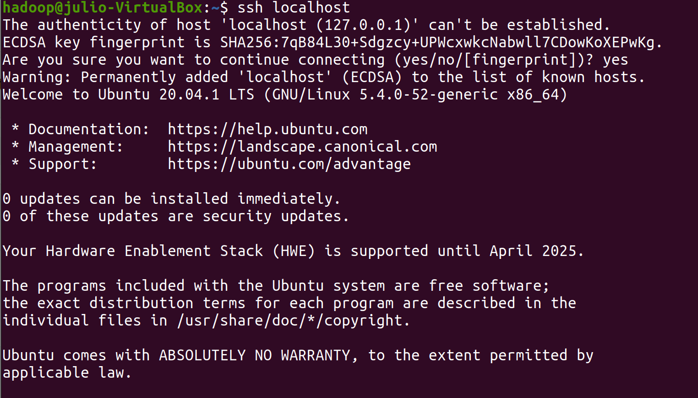

# Hadoop: HDFS and Map Reduce

Apache Hadoop is a framework for distributed storage (HDFS) and distributed processing (Map Reduce). It also contains YARN, an API for managing computer resources in the hadoop environment

## How to install a Hadoop Cluster

In the following steps, we are going to deep into the installation of Hadoop on a single node cluster also called "Pseudo Distributed Mode" in our local machine.

Hadoop can be installed in both Unix (including Linux, Mac OS) and Windows. However Unix is the only supported production platform. Thus, we strongly suggest you use a Linux OS distribution such as Ubuntu, Linux Mint or CentOS. In case you don't have Linux as host OS, you can always install a Virtual Machine as shown in the tutorial.

Note: You can also use Cloud providers such as Amazon or GoogleCloud to create a Linux Virtual machine and run Apache Hadoop from the Cloud.

### 1. Installing Ubuntu Virtual Machine:

For this step, you can download Oracle VM VirtualBox, download the ISO of Ubuntu from the official site and follow the steps of the link ["How To Install Ubuntu 20.04 LTS On VirtualBox"](https://fossbytes.com/how-to-install-ubuntu-20-04-lts-virtualbox-windows-mac-linux/).

You can install Ubunto or Linux Mint if you want a better graphic interface. Otherwise, you can install CentOS to manage everything from command line.

In this tutorial, we have installed a VM of Ubuntu 20.04 LTS with the following features to maximize the performance of our Hadoop server:

* OS: Ubuntu 20.04 LTS
* RAM: 8GB
* Processors: 5 cores
* Storage: 20GB with dynamic allocation
* Video Memory: 16 MB

<p align="center"></p>

You can also connect by command line from Windows to your Ubuntu VM (if you are still stubborn to work from Windows) configuring the NAT Network ports as shown in this link ["Network Settings"](https://en.blog.businessdecision.com/tutorial-how-to-install-a-hadoop-cluster/). Be aware that for Ubuntu 20, the network configuration is done by the netplan utility, so you can follow this link ["Configuring network between Host and Guest VM"](https://zhauniarovich.com/post/2020/2020-01-configuring-network/)

<p align="center"></p>

### 2. Initial requirements

Once our Ubuntu VM is installed, we need to install some basic utilities to work with Hadoop:

* Basic utilities after installing Ubunty from zero.

```console

sudo apt update
apt install net-tools

```

* Java JDK: Hadoop has been written in Java and all its services require Java packages. The new versions of hadoop 3.* supports Java 8.

```console

sudo apt install openjdk-8-jdk

```

* SSH Server and Client 

```console

sudo apt-get install ssh
sudo apt-get install pdsh

```

### 3. Create a Hadoop user

The main purpose is to create a new user exclusively dedicated for running hadoop without the necessity to provide username or password. We will also store DataNode and NameNode files in this folder.

* Create user hadoop to manage our environment and switch to that user

```console
sudo adduser hadoop
su - hadoop
```

* Give permissions to the user to execute ssh without using password and username (in order to easily start hadoop service). This step needs to be executed with the new "hadoop" user

```console
ssh-keygen -t rsa -P '' -f ~/.ssh/id_rsa
cat ~/.ssh/id_rsa.pub >> ~/.ssh/authorized_keys
chmod 0600 ~/.ssh/authorized_keys
```

* You can verify you have access with the following command from the hadoop user:

```console
ssh localhost
```

<p align="center"></p>

### 4. Hadoop Configuration

In the next steps we are going to extract a stable version of Apache Hadoop from the official site and set up the main files to implement the Hadoop environment

* Set the main location to our hadoop user folder

```console
cd /home/hadoop
```

* Extract Hadoop 3.2.1 (last stable version) from the official website

```console
wget https://apache.mediamirrors.org/hadoop/common/stable/hadoop-3.2.1.tar.gz
```

* Unzip the hadoop package and change the name (to manage hadoop easily)

```console
tar xvf hadoop-3.2.1.tar.gz
mv hadoop-3.2.1 hadoop
```

* Set up principal environmental variables in bashrc file

```console
sudo nano ~/.bashrc
```

> Add the following to the file:

1) Variables related to hadoop environment (main paths):

```console
export HADOOP_HOME=/usr/local/hadoop-3.2.1
export HADOOP_INSTALL=$HADOOP_HOME
export HADOOP_MAPRED_HOME=$HADOOP_HOME
export HADOOP_COMMON_HOME=$HADOOP_HOME
export HADOOP_HDFS_HOME=$HADOOP_HOME
export YARN_HOME=$HADOOP_HOME
export HADOOP_COMMON_LIB_NATIVE_DIR=$HADOOP_HOME/lib/native
export PATH=$PATH:$HADOOP_HOME/sbin:$HADOOP_HOME/bin
export HADOOP_OPTS="-Djava.library.path=$HADOOP_HOME/lib/native"
```

2) Variables related to the user. Otherwise you will get an error ["No HDFS_NAMENODE_USER defined"](https://stackoverflow.com/questions/48129029/hdfs-namenode-user-hdfs-datanode-user-hdfs-secondarynamenode-user-not-defined):

```console
export HDFS_NAMENODE_USER="hadoop"
export HDFS_DATANODE_USER="hadoop"
export HDFS_SECONDARYNAMENODE_USER="hadoop"
export YARN_RESOURCEMANAGER_USER="hadoop"
export YARN_NODEMANAGER_USER="hadoop"
```

3) Variables to fix ssh issue ["Connection refused"](https://stackoverflow.com/questions/48189954/hadoop-start-dfs-sh-connection-refused) when starting Apache hadoop service :

```console
export PDSH_RCMD_TYPE=ssh
```

## Useful Links:

* https://phoenixnap.com/kb/install-hadoop-ubuntu
* https://en.blog.businessdecision.com/tutorial-how-to-install-a-hadoop-cluster/
* https://linuxconfig.org/how-to-install-hadoop-on-ubuntu-18-04-bionic-beaver-linux
