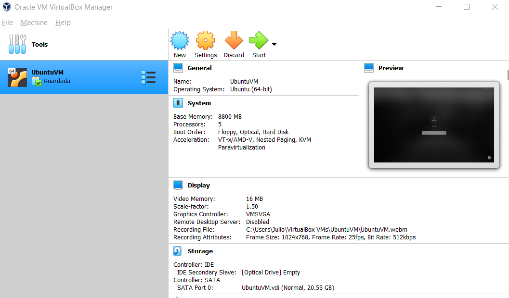
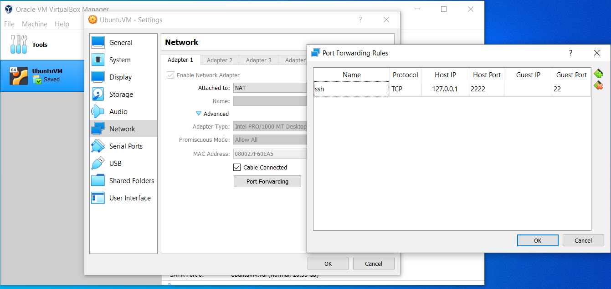

# Hadoop: HDFS and Map Reduce

Apache Hadoop is a framework for distributed storage (HDFS) and distributed processing (Map Reduce). It also contains YARN, an API for managing computer resources in the hadoop environment

## How to install a Hadoop Cluster

In the following steps, we are going to deep into the installation of Hadoop on a single node cluster also called "Pseudo Distributed Mode" in our local machine.

Hadoop can be installed in both Unix (including Linux, Mac OS) and Windows. However Unix is the only supported production platform. Thus, we strongly suggest you use a Linux OS distribution such as Ubuntu, Linux Mint or CentOS. In case you don't have Linux as host OS, you can always install a Virtual Machine as shown in the tutorial.

Note: You can also use Cloud providers such as Amazon or GoogleCloud to create a Linux Virtual machine and run Apache Hadoop from the Cloud.

### 1. Installing Ubuntu Virtual Machine:

For this step, you can download Oracle VM VirtualBox, download the ISO of Ubuntu from the official site and follow the steps of the link ["How To Install Ubuntu 20.04 LTS On VirtualBox"](https://fossbytes.com/how-to-install-ubuntu-20-04-lts-virtualbox-windows-mac-linux/).

You can install Ubunto or Linux Mint if you want a better graphic interface. Otherwise, you can install CentOS to manage everything from command line.

In this tutorial, we have installed a VM of Ubuntu 20.04 LTS with the following features to maximize the performance of our Hadoop server:

* OS: Ubuntu 20.04 LTS
* RAM: 8GB
* Processors: 5 cores
* Storage: 20GB with dynamic allocation
* Video Memory: 16 MB

<p align="center"></p>

You can also connect by command line from Windows to your Ubuntu VM (if you are still stubborn to work from Windows) configuring the NAT Network ports as shown in this link ["Network Settings"](https://en.blog.businessdecision.com/tutorial-how-to-install-a-hadoop-cluster/). Be aware that for Ubuntu 20, the network configuration is done by the netplan utility, so you can follow this link ["Configuring network between Host and Guest VM"](https://zhauniarovich.com/post/2020/2020-01-configuring-network/)

<p align="center"></p>

### 2. Initial requirements

Once our Ubuntu VM is installed, we need to install some basic utilities to work with Hadoop:

* Basic utilities

```sh

sudo apt update
apt install net-tools

```

* Java JDK
* SSH Server and Client 

## Useful Links:

* https://en.blog.businessdecision.com/tutorial-how-to-install-a-hadoop-cluster/
* https://linuxconfig.org/how-to-install-hadoop-on-ubuntu-18-04-bionic-beaver-linux
