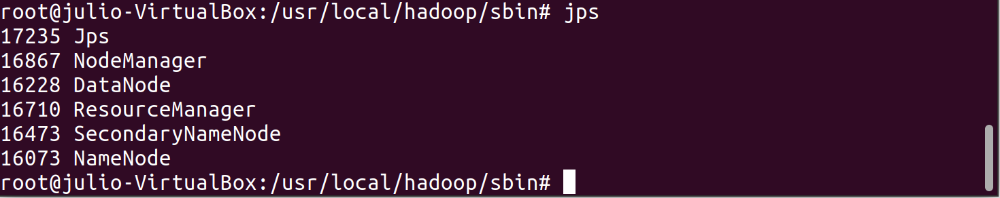

# Hadoop: HDFS and Map Reduce

Apache Hadoop is a framework for distributed storage (HDFS) and distributed processing (Map Reduce). It also contains YARN, an API for managing computer resources in the hadoop environment

## How to install a Hadoop Cluster

In the following steps, we are going to deep into the installation of Hadoop on a single node cluster also called "Pseudo Distributed Mode" in our local machine.

Hadoop can be installed in both Unix (including Linux, Mac OS) and Windows. However Unix is the only supported production platform. Thus, we strongly suggest you use a Linux OS distribution such as Ubuntu, Linux Mint or CentOS. In case you don't have Linux as host OS, you can always install a Virtual Machine as shown in the tutorial.

Note: You can also use Cloud providers such as Amazon or GoogleCloud to create a Linux Virtual machine and run Apache Hadoop from the Cloud.

### 1. Installing Ubuntu Virtual Machine:

For this step, you can download Oracle VM VirtualBox, download the ISO of Ubuntu from the official site and follow the steps of the link ["How To Install Ubuntu 20.04 LTS On VirtualBox"](https://fossbytes.com/how-to-install-ubuntu-20-04-lts-virtualbox-windows-mac-linux/).

You can install Ubunto or Linux Mint if you want a better graphic interface. Otherwise, you can install CentOS to manage everything from command line.

In this tutorial, we have installed a VM of Ubuntu 20.04 LTS with the following features to maximize the performance of our Hadoop server:

* OS: Ubuntu 20.04 LTS
* RAM: 8GB
* Processors: 5 cores
* Storage: 20GB with dynamic allocation
* Video Memory: 16 MB

<p align="center"></p>

You can also connect by command line from Windows to your Ubuntu VM (if you are still stubborn to work from Windows) configuring the NAT Network ports as shown in this link ["Network Settings"](https://en.blog.businessdecision.com/tutorial-how-to-install-a-hadoop-cluster/). Be aware that for Ubuntu 20, the network configuration is done by the netplan utility, so you can follow this link ["Configuring network between Host and Guest VM"](https://zhauniarovich.com/post/2020/2020-01-configuring-network/)

<p align="center"></p>

### 2. Initial requirements

Once our Ubuntu VM is installed, we need to install some basic utilities to work with Hadoop:

* Basic utilities after installing Ubunty from zero.

```console

sudo apt update
apt install net-tools

```

* Java JDK: Hadoop has been written in Java and all its services require Java packages. The new versions of hadoop 3.* supports Java 8.

```console

sudo apt install openjdk-8-jdk

```

* SSH Server and Client 

```console

sudo apt-get install ssh
sudo apt-get install pdsh

```

### 3. Create a Hadoop user

The main purpose is to create a new user exclusively dedicated for running hadoop without the necessity to provide username or password. We will also store DataNode and NameNode files in this folder.

* Create user hadoop to manage our environment and switch to that user

```console
sudo adduser hadoop
su - hadoop
```

* Give permissions to the user to execute ssh without using password and username (in order to easily start hadoop service). This step needs to be executed with the new "hadoop" user

```console
ssh-keygen -t rsa -P '' -f ~/.ssh/id_rsa
cat ~/.ssh/id_rsa.pub >> ~/.ssh/authorized_keys
chmod 0600 ~/.ssh/authorized_keys
```

* You can verify you have access with the following command from the hadoop user:

```console
ssh localhost
```

<p align="center"></p>

### 4. Hadoop Installation

In the next steps we are going to extract a stable version of Apache Hadoop from the official site. This installation is simple from Linux.

* Set the main location to our hadoop user folder

```console
cd /home/hadoop
```

* Extract Hadoop 3.2.1 (last stable version) from the official website

```console
wget https://apache.mediamirrors.org/hadoop/common/stable/hadoop-3.2.1.tar.gz
```

* Unzip the hadoop package and change the name (to manage hadoop easily)

```console
tar xvf hadoop-3.2.1.tar.gz
mv hadoop-3.2.1 hadoop
```

### 5. Hadoop Configuration

Depending on your implementation, hadoop requires to configure some files in the installation path. We will take a look at the more important ones to run hadoop in single or distributed mode:

#### 5.1 Environmental variables file

* Set up principal environmental variables in bashrc file

```console
sudo nano ~/.bashrc
```

* Add the following to the file:

>> Variables related to hadoop environment (main paths):

```dos
export HADOOP_HOME=/usr/local/hadoop-3.2.1
export HADOOP_INSTALL=$HADOOP_HOME
export HADOOP_MAPRED_HOME=$HADOOP_HOME
export HADOOP_COMMON_HOME=$HADOOP_HOME
export HADOOP_HDFS_HOME=$HADOOP_HOME
export YARN_HOME=$HADOOP_HOME
export HADOOP_COMMON_LIB_NATIVE_DIR=$HADOOP_HOME/lib/native
export PATH=$PATH:$HADOOP_HOME/sbin:$HADOOP_HOME/bin
export HADOOP_OPTS="-Djava.library.path=$HADOOP_HOME/lib/native"
```

>> Variables related to the user. Otherwise you will get an error ["No HDFS_NAMENODE_USER defined"](https://stackoverflow.com/questions/48129029/hdfs-namenode-user-hdfs-datanode-user-hdfs-secondarynamenode-user-not-defined):

```dos
export HDFS_NAMENODE_USER="hadoop"
export HDFS_DATANODE_USER="hadoop"
export HDFS_SECONDARYNAMENODE_USER="hadoop"
export YARN_RESOURCEMANAGER_USER="hadoop"
export YARN_NODEMANAGER_USER="hadoop"
```

>> Variables to fix ssh issue ["Connection refused"](https://stackoverflow.com/questions/48189954/hadoop-start-dfs-sh-connection-refused) when starting Apache hadoop service :

```dos
export PDSH_RCMD_TYPE=ssh
```

* Make the changes effective

```console
source ~/.bashrc
```

#### 5.2 Configure hadoop-env.sh file

hadoop-env.sh is like a masterfile in which you can configure different general project settings of HDFS, Map Reduce, YARN and Hadoop environment. For our purpose, we are mainly going to modify the path of JAVA. (You can check where the Java JDK has been installed in your machine):

* Open the file to edit

```console
sudo nano $HADOOP_HOME/etc/hadoop/hadoop-env.sh
```

* Uncomment and complete the JAVA_HOME path

```dos
export JAVA_HOME=/usr/lib/jvm/java-8-openjdk-amd64
```

#### 5.3 Configure core-site.xml file

This file allows to set up HDFS and Hadoop Map Reduce properties. This file resides in each node and ,specifically, allows to identify where the namenodes are running as well as I/O settings for HDFS and Map Reduce. Likewise, we can specify the temporal storage for map reduce operations.

* Open the file to edit:

```console
sudo nano $HADOOP_HOME/etc/hadoop/core-site.xml
```

* Replace the empty configuration: The first property modifies the temporal folder for Map Reduce operations and the second property assigns an URL to the datanode. We are going to connect to this URL when we want to write/read to our HDFS from an external environment like Java, Python and others:

```dos
<configuration>
<property>
  <name>hadoop.tmp.dir</name>
  <value>/home/hadoop/tmpdata</value>
</property>
<property>
  <name>fs.default.name</name>
  <value>hdfs://127.0.0.1:9000</value>
</property>
</configuration>
```

* Create temporary folder

```console
mkdir /home/hadoop/tmpdata
```

#### 5.4 Configure hdfs-site.xml file

The hdfs-site.xml file contains information related to HDFS configuration such as the NameNodes, Secondary NameNodes and DataNodes. We can configure the storage locations of node's metadata as well as the replication factor.

* Open the file to edit:

```console
sudo nano $HADOOP_HOME/etc/hadoop/hdfs-site.xml
```

* Replace the empty configuration: The first property sets the storage location of the namenode, the second property sets the storage location of the datanode and the last propoerty sets the replication factor (by default is 3)

```dos
<configuration>
<property>
  <name>dfs.data.dir</name>
  <value>/home/hdoop/dfsdata/namenode</value>
</property>
<property>
  <name>dfs.data.dir</name>
  <value>/home/hdoop/dfsdata/datanode</value>
</property>
<property>
  <name>dfs.replication</name>
  <value>1</value>
</property>
</configuration>
```

* Create namenode and datanode folder (the specific folder will be created when starting the service)

```console
mkdir /home/hdoop/dfsdata
```

#### 5.5 Configure mapred-site.xml file

This file allows to configure Map Reduce parameters

* Open the file to edit:

```console
sudo nano $HADOOP_HOME/etc/hadoop/mapred-site.xml
```

* Replace the empty configuration to set the Map Reduce Framework to YARN:

```dos
<configuration> 
<property> 
  <name>mapreduce.framework.name</name> 
  <value>yarn</value> 
</property> 
</configuration>
```

#### 5.6 Configure yarn-site.xml file

The files allows to configure parameters related to the Resource Manager, Node Manager, Containers and Application master

* Open the file to edit:

```console
sudo nano $HADOOP_HOME/etc/hadoop/yarn-site.xml
```

* Replace the empty configuration with: The first two properties modify the node manager, the next one modifies the default url of the resource manager and the rest give permissions to access to the selected paths:

```dos
<configuration>
<property>
  <name>yarn.nodemanager.aux-services</name>
  <value>mapreduce_shuffle</value>
</property>
<property>
  <name>yarn.nodemanager.aux-services.mapreduce.shuffle.class</name>
  <value>org.apache.hadoop.mapred.ShuffleHandler</value>
</property>
<property>
  <name>yarn.resourcemanager.hostname</name>
  <value>127.0.0.1</value>
</property>
<property>
  <name>yarn.acl.enable</name>
  <value>0</value>
</property>
<property>
  <name>yarn.nodemanager.env-whitelist</name>         <value>JAVA_HOME,HADOOP_COMMON_HOME,HADOOP_HDFS_HOME,HADOOP_CONF_DIR,CLASSPATH_PERPEND_DISTCACHE,HADOOP_YARN_HOME,HADOOP_MAPRED_HOME</value>
</property>
</configuration>
```

#### 5.7 Configure hadoop-functions.sh file

You can configure this file if you have ["ssh issues"](https://stackoverflow.com/questions/48189954/hadoop-start-dfs-sh-connection-refused) when starting the service.

* Open the file to edit:

```console
sudo nano $HADOOP_HOME/libexec/hadoop-functions.sh
```

* Search for variable PDSH_RCMD_TYPE and replace all the line:

```dos
PDSH_RCMD_TYPE=ssh PDSH_SSH_ARGS_APPEND="${HADOOP_SSH_OPTS}" pdsh \
```

### 6. Start Hadoop

* Format datanodes:

```console
hdfs namenode -format
```

* Locate in Hadoop executable folder

```console
cd $HADOOP_HOME/sbin
```

* Start the namenode and datanode

```console
./start-dfs.sh
```

* Start YARN

```console
./start-yarn.sh
```

* Validate all the services are running. 

```console
jps
```

* After executing this command, you should see this services running. If you don't see all of them, you may have some problems with your hdfs:

<p align="center"></p>

 

## Useful Links:

* https://phoenixnap.com/kb/install-hadoop-ubuntu
* https://en.blog.businessdecision.com/tutorial-how-to-install-a-hadoop-cluster/
* https://linuxconfig.org/how-to-install-hadoop-on-ubuntu-18-04-bionic-beaver-linux
* https://www.edureka.co/blog/explaining-hadoop-configuration/
